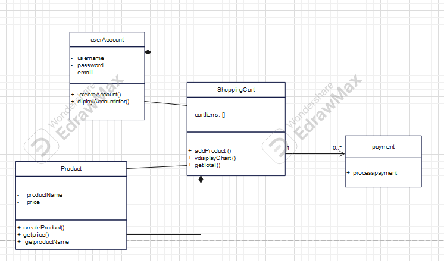

# Title: Online-Shopping-System

# PURPOSE OF THE SYSTEM :
  This UML design represents an e-commerce system that allows users to creat account, add products to their shopping charts, checkout, and make payments.

  # UML CLASS DIAGRAM
   This is the class diagram and implementation. 
   
   
   
